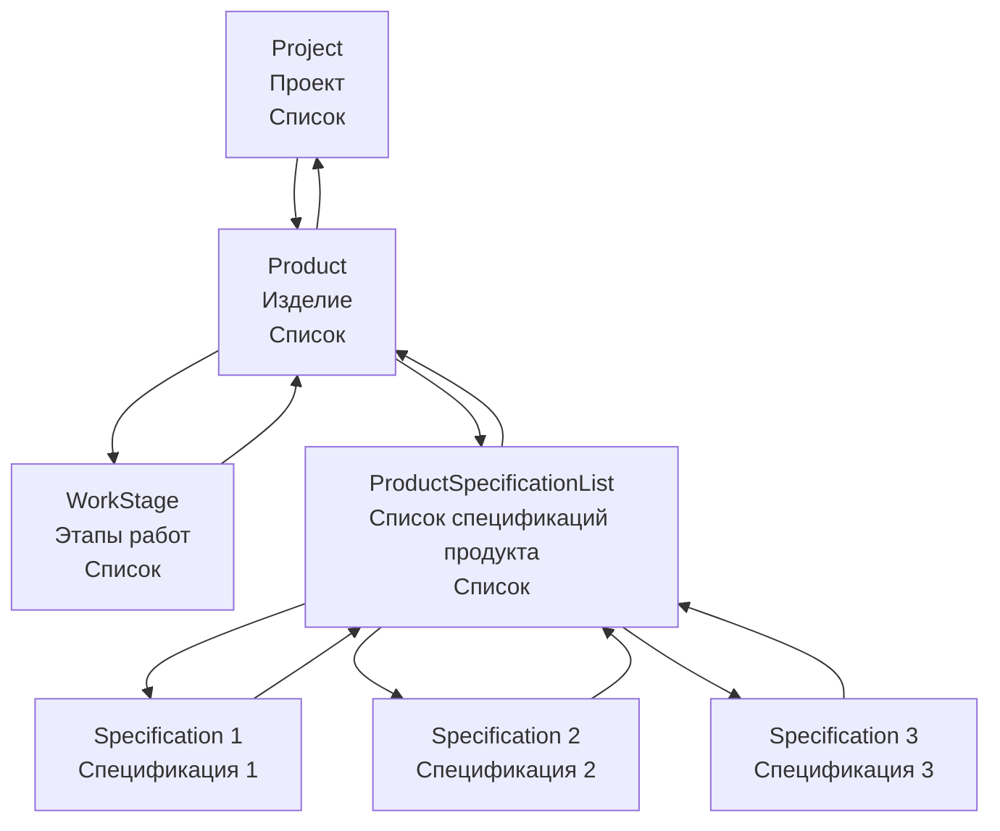

# Структура навигации проектов

```mermaid
graph TD
    A[Project</br>Проект</br>Список] --> B[Product</br>Изделие</br>Список]
    B --> C[WorkStage</br>Этапы работ</br>Список]
    B --> D[ProductSpecificationList</br>Список спецификаций продукта</br>Список]
    C --> B
    D --> B
    B --> A
    
    D --> E[Specification 1</br>Спецификация 1]
    D --> F[Specification 2</br>Спецификация 2]
    D --> G[Specification 3</br>Спецификация 3]
    E --> D
    F --> D
    G --> D
    

```
